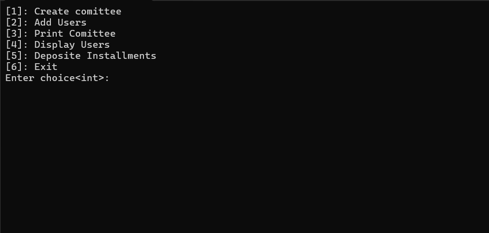

# Commitee System in C++ OOP:

## Clone this Project:

Open terminal and run:

```
git clone https://github.com/Ali1raz/committee-management-system-in-cpp.git cms
```

This will create `cms` directory. Open it and compile and run main.cpp.



## Features:

- Checks from files if already saved info.
- Add Committee Details First
- Add users Details
- Total Installments will be equal to user count.
- When users deposit installments, one of them is selected and given all the balance in committee.
- All the users keep depositing their installments.
- Users who are selected once, don't get payout again.
-
