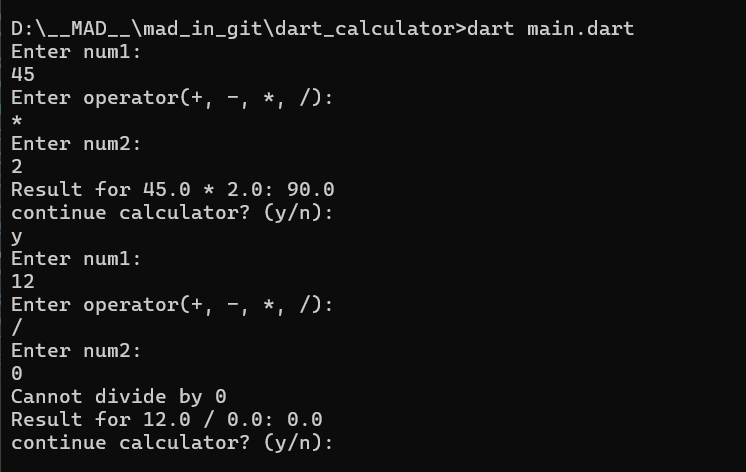

# A Basic Calculator in Dart.

```bash
dart main.dart
```



# Variables:

> \<datatype> \<variableName> = value;

`int` e.g.: 3

`String` e.g.: "Ali"

`double` e.g.: 3.23

`bool` e.g.: true/false.

`dynamic` can have any value[different at runTime and compileTime] (not recommended).

## String interpolation:

```dart
String greeting = "Hye";
greeting = greeting + "Ali"; // bad
greeting = `$greeting Ali`; // good
greeting = `${greeting.length} Ali`; // good
```

## Mutability:

`var` value type can be changed.

`final` value type can't be changed. [runtime constant]

`const` value type can't be changed. [compileTime constant]

```dart
int age = null; // bad
int? age = null; // make int optional instead
```

```dart
String name;
name.length; // error
name?.length; // ok, optional chaining.
```

---

## Control Flow:

```dart
if (condition1) {
    // do this
} else if (condition2) {
    // do this...
} else {
// do this
}


// Null-coalescing operator: ??
String? name = null;
Stirng result = name ?? "No name"; // result = "No name"

// Null-aware access operator
name?.length;
```

### Short-circuting: && and ||

```dart
bool a = false;
bool b = true;
if (a && (b= false)) {
    // a is false b won't be reassigned.
    // so this wont run
}
print(b); // true
```
