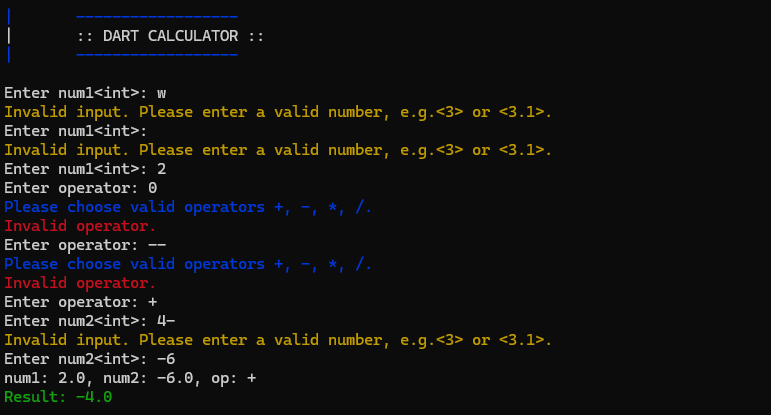

# A Basic Calculator in Dart.

```bash
dart main.dart
```



## String interpolation:

```dart
String greeting = "Hye";
greeting = greeting + "Ali"; // bad
greeting = `$greeting Ali`; // good
greeting = `${greeting.length} Ali`; // good
```

# Take double as input with error handling:

```dart
double input_double(String prompt) {
  while (true) {
    stdout.write(prompt);
    String? input = stdin.readLineSync();
    if (input != null) {
      double? number = double.tryParse(input);
      if (number != null) {
        return number; // valid double
      }
    }
    print("Invalid input. Please enter a valid number, e.g.<3> or <3.1>.");
  }
}
```

# Take Operator input with error handling:

```dart
bool isValidOperator(String input) {
  RegExp reg = RegExp(r'^[+\-*/]$'); // valid operators +, -, *, /

  return reg.hasMatch(input);
}
```
