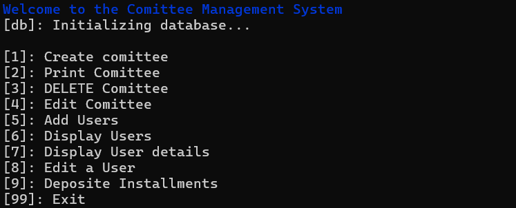
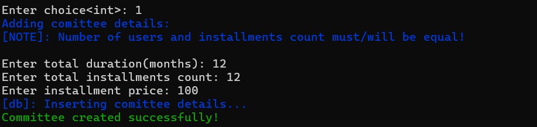
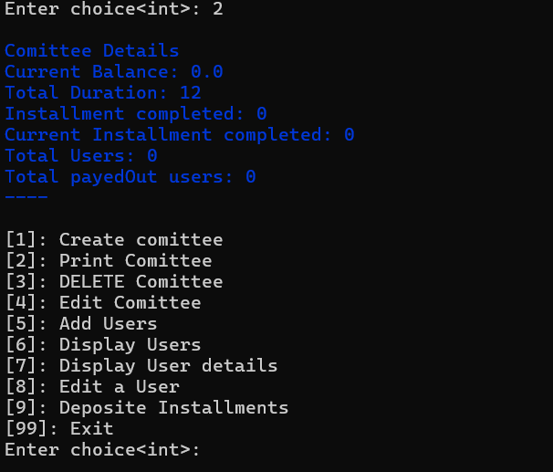
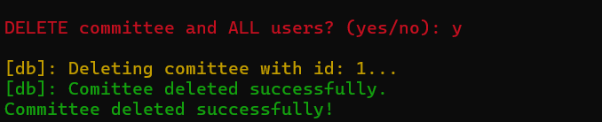
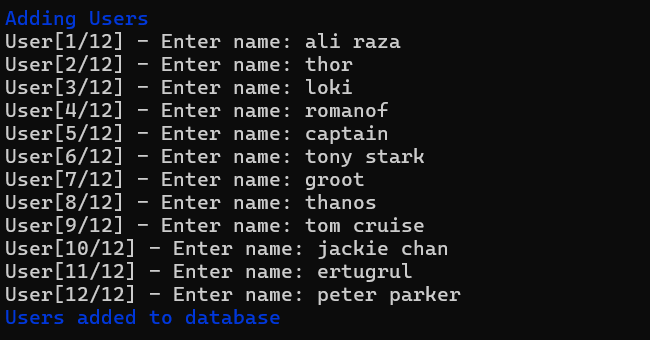
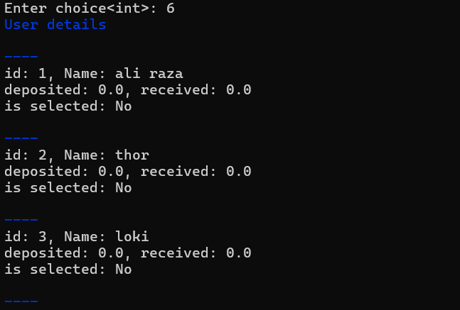
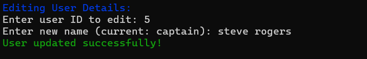
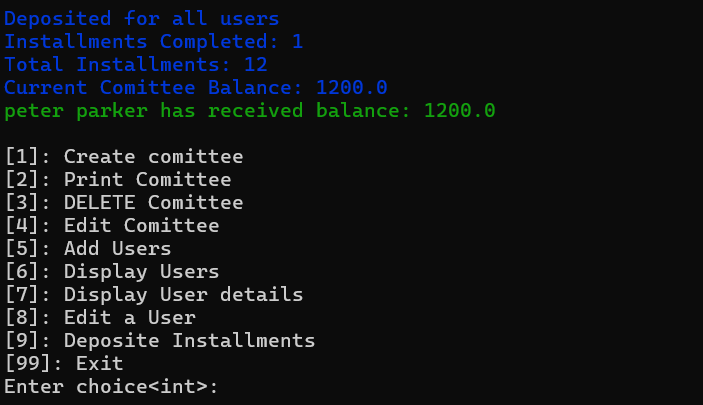
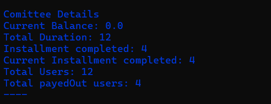

A sample command-line application with an entrypoint in `bin/`, library code
in `lib/`, and example unit test in `test/`.

# Comittee Management System in dart using OOP

<div style="display: flex; flex-wrap:wrap; gap: 10px">
    
    
    
    
    
    
    
    
    
</div>

## Getting Started:

```bash
dart pub get
dart run
```

## Util functions:

`input_int` takes input as int as long as user inputs wrong/empty input.

`input_double` takes input as double as long as user inputs wrong/empty input.

`input_string` takes input as long as user inputs empty input.

---
