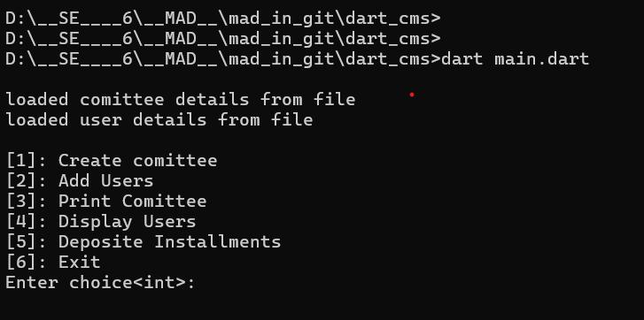
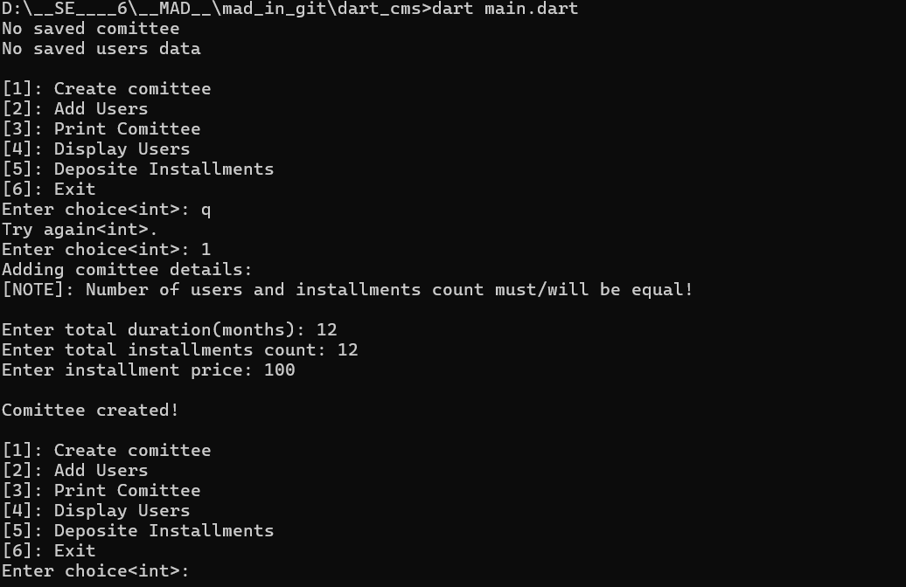
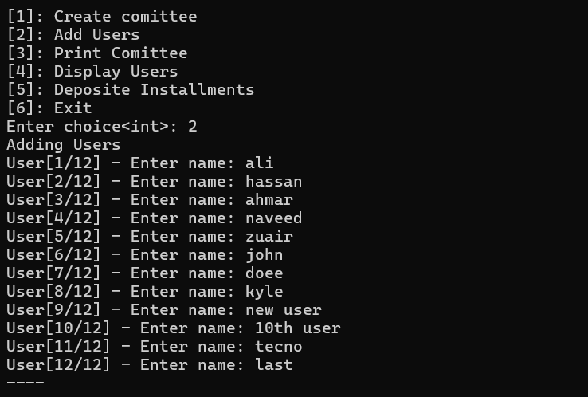
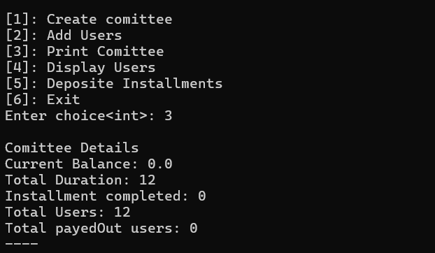
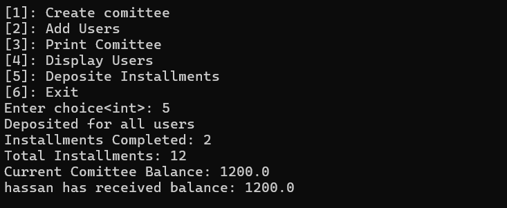

# Comittee Management System in dart using OOP

## References:
[chatgpt](https://chatgpt.com/share/67c665a7-b8a4-800e-926c-809d8341fd22)

## Getting Started:

```bash
dart main.dart
```

## Util functions:

`input_int` takes input as int as long as user inputs wrong/empty input.

`input_double` takes input as double as long as user inputs wrong/empty input.

`input_string` takes input as long as user inputs empty input.

## txt File Handling:

docs: [file handling in dart](https://dart-tutorial.com/file-handling-in-dart/write-file-in-dart/)

<div style="">





</div>

# chatgpt

[https://chatgpt.com/share/67c665a7-b8a4-800e-926c-809d8341fd22](https://chatgpt.com/share/67c665a7-b8a4-800e-926c-809d8341fd22)

