# Flashcard App

## Features

- **Multiple Decks**: Organize flashcards into categories (e.g., "Flutter Basics", "Dart").
- **Score Tracking**: Earn points for correct answers and lose points for incorrect ones.
- **User-Created Flashcards**: Add new cards with validation for empty inputs.
- **State Management**: Uses `riverpod` for app-wide state.
- **Clean Architecture**: Separates logic into `screens`, and `widgets`.

1. **Home Screen**:

   - Tap a deck to start studying.

2. **Deck page**:

   - Use the **Add card** button to add new flashcards.
   - Tap the card to flip between question and answer.
   - Press **Correct**/**Incorrect** to update your score.
   - Press **Reset Card** to reset Card isAnswered.

3. **Create Flashcards**:
   - Fill in the question and answer fields (non-empty validation).
   - Save to add the card to the selected deck.

---

## Technology Stack

- **Flutter**: UI toolkit for building natively compiled apps.
- **Dart**: Programming language optimized for client-side development.
- **Riverpod**: State management for app-wide data (decks, scores).

---

## Screenshots

   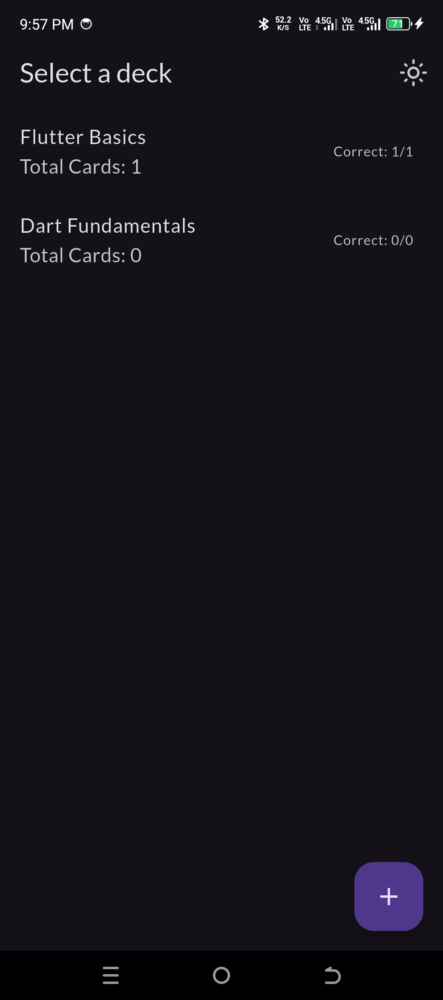
   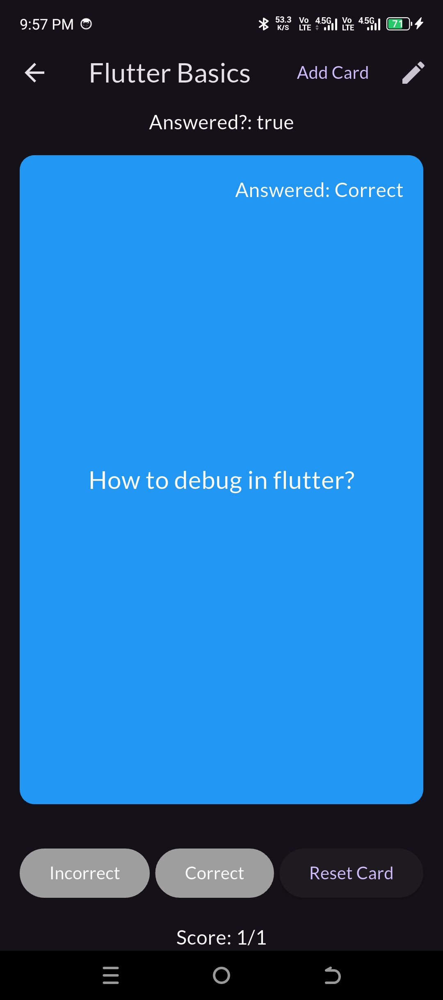
   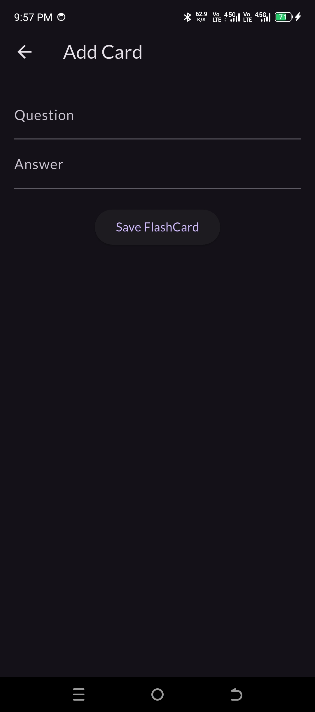
   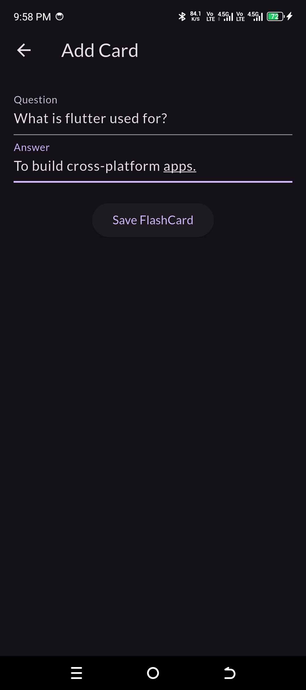
   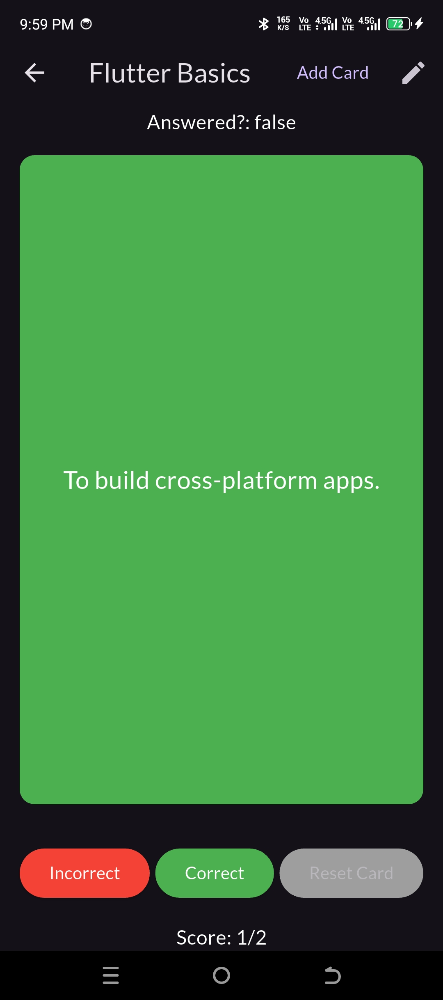
   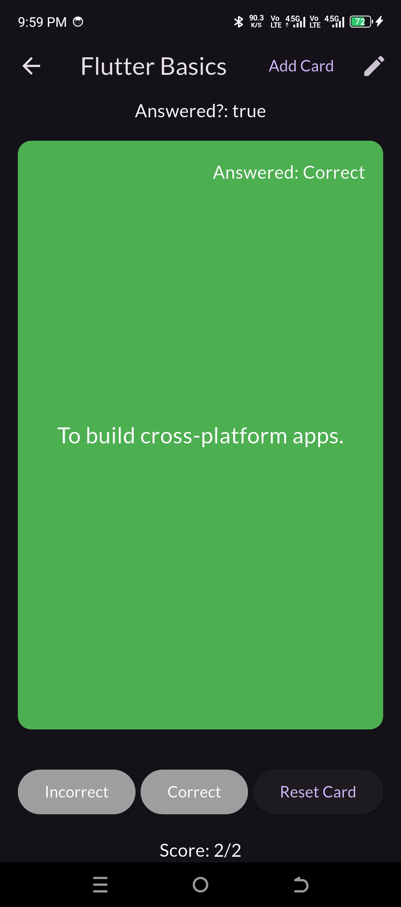
   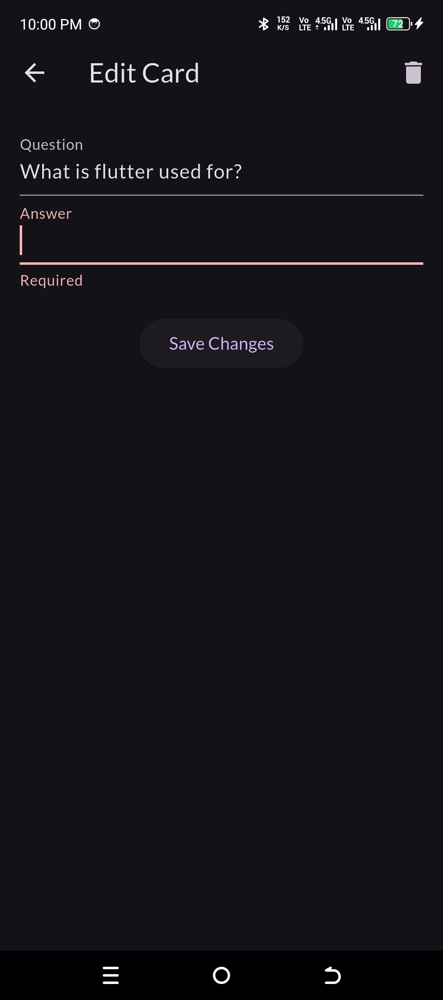
   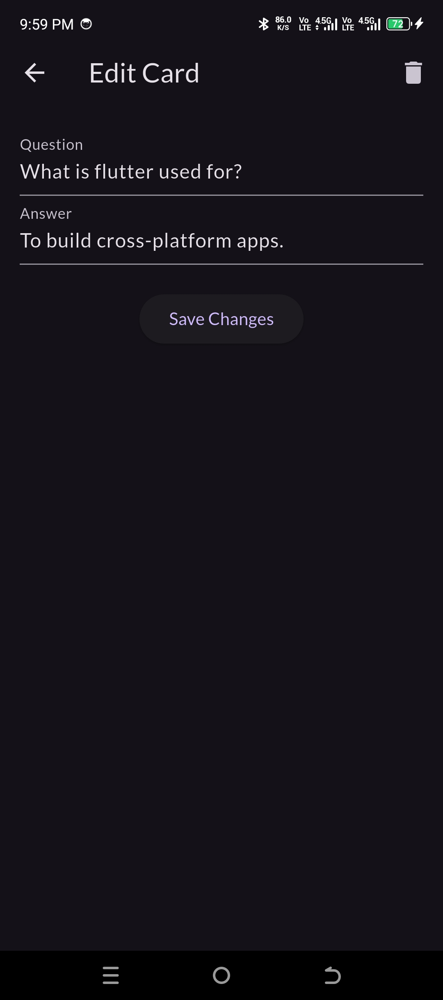
   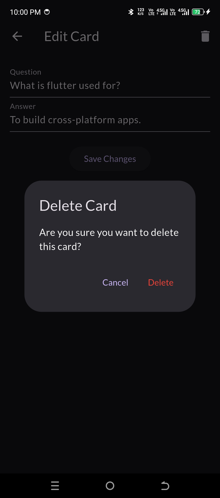
   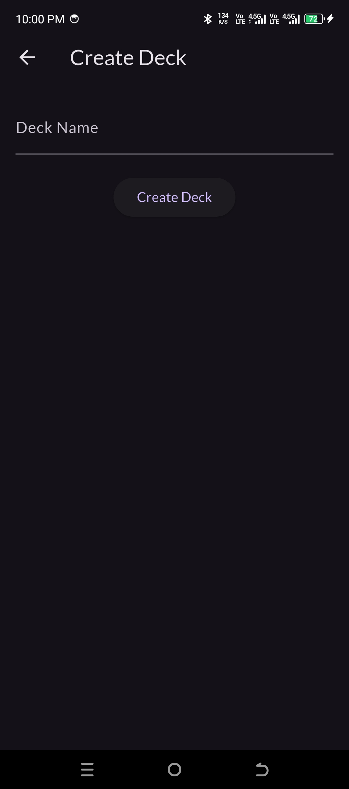
   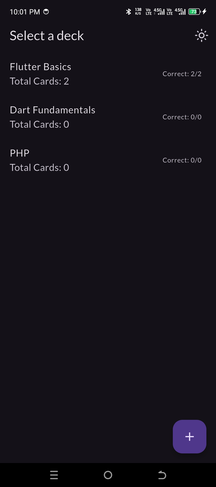
   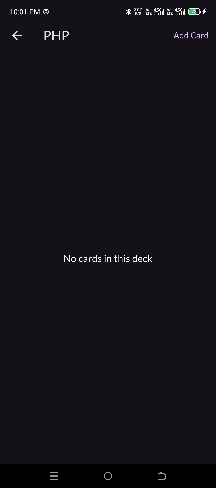
   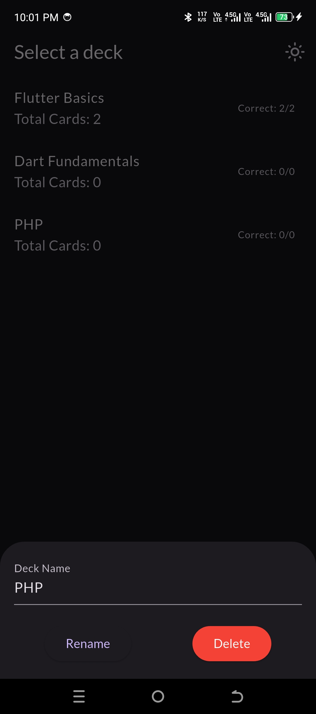

---

## Demo Video

---
