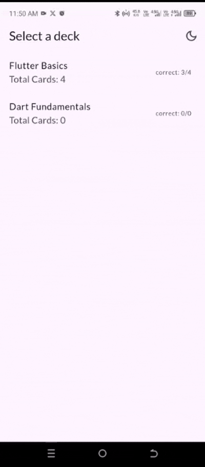

markdown

# Flashcard App

A Flutter-based application for creating and studying flashcards with multiple decks, score tracking, and smooth animations. Built to demonstrate core Flutter concepts like state management, navigation, and responsive design.

---

## Features

- **Multiple Decks**: Organize flashcards into categories (e.g., "Flutter Basics", "Dart").
- **Score Tracking**: Earn points for correct answers and lose points for incorrect ones.
- **User-Created Flashcards**: Add new cards with validation for empty inputs.
- **Smooth Animations**: Card flip effect using `AnimatedSwitcher` and `RotationTransition`.
- **Responsive Design**: Adapts layout for phones and tablets.
- **State Management**: Uses `Provider` and `ChangeNotifier` for app-wide state.
- **Clean Architecture**: Separates logic into `models`, `screens`, and `widgets`.

---

## Installation

1. **Prerequisites**:

   - Flutter SDK (latest stable version)
   - Dart SDK

2. **Steps**:

```bash
flutter pub get
flutter run
```

---

## Usage

1. **Home Screen**:

   - Tap a deck to start studying.
   - Use the floating "+" button to add new flashcards.

2. **Study Mode**:

   - Tap the card to flip between question and answer.
   - Press **Correct**/**Incorrect** to update your score.
   - Navigate cards with **Prev**/**Next** buttons.

3. **Create Flashcards**:
   - Select a deck from the dropdown.
   - Fill in the question and answer fields (non-empty validation).
   - Save to add the card to the selected deck.

---

## Technology Stack

- **Flutter**: UI toolkit for building natively compiled apps.
- **Dart**: Programming language optimized for client-side development.
- **Provider**: State management for app-wide data (decks, scores).
- **AnimatedSwitcher**: Smooth transitions for card flips.
- **LayoutBuilder**: Responsive design handling.

---

## Project Structure

lib/
├── main.dart # App entry point
├── models/ # Data classes
│ ├── deck.dart # Deck model
│ └── flashcard.dart # Flashcard model
├── screens/ # Full-page UIs
│ ├── add_flashcard_screen.dart # Form for new cards
│ ├── deck_selection_screen.dart # Deck list
│ └── flashcard_screen.dart # Study interface
└── widgets/ # Reusable components
├── flashcard_widget.dart # Animated card
└── navigation_controls.dart # Responsive buttons

---

## Screenshots

| Deck Selection                        | Add Flashcard                      | Cards                         |
| ------------------------------------- | ---------------------------------- | ----------------------------- |
|  |  |  |

---

## Demo Video

[Watch a demo here](screenshots/Recording.gif).



---

## Contributing

Feel free to:

- Open issues for bugs/feature requests.
- Submit PRs for improvements.
- Star the repo if you find it useful! ⭐

---

### Notes:

1. Replace your-username, your-demo-link.com, and screenshot paths with actual values.
2. Add screenshots to a /screenshots folder in your repo.
3. Customize the _License_ section if needed.
