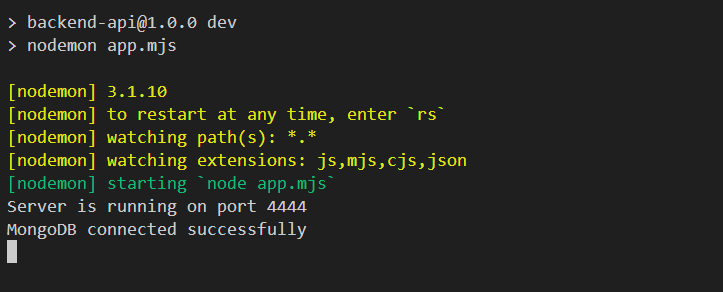
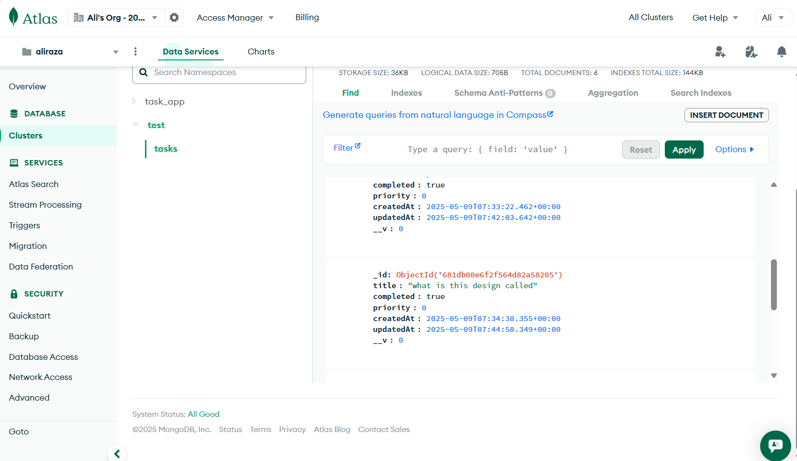
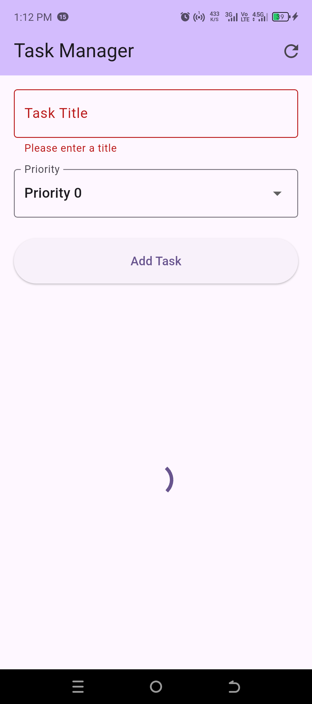
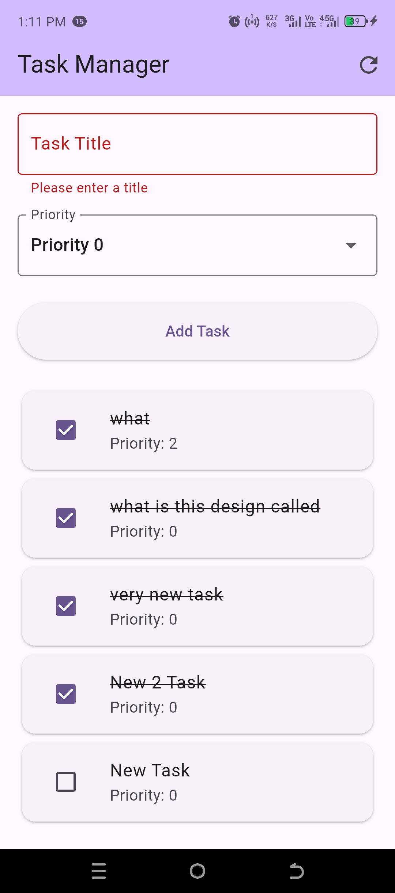
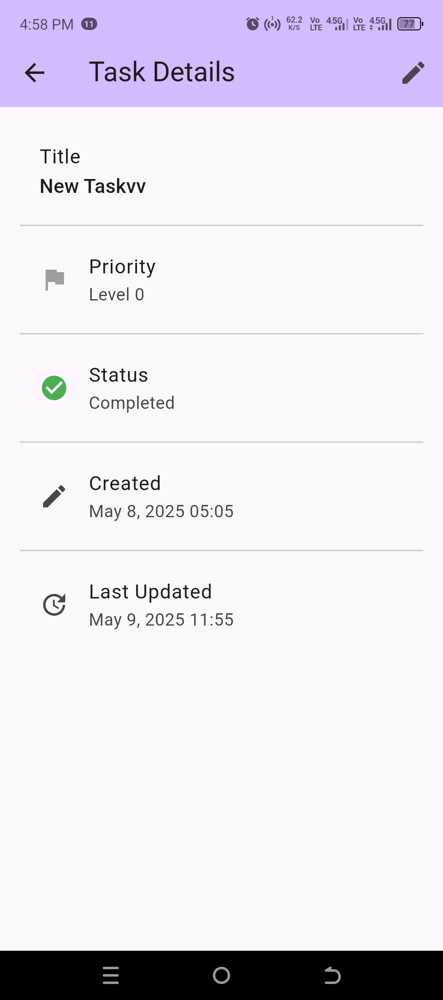
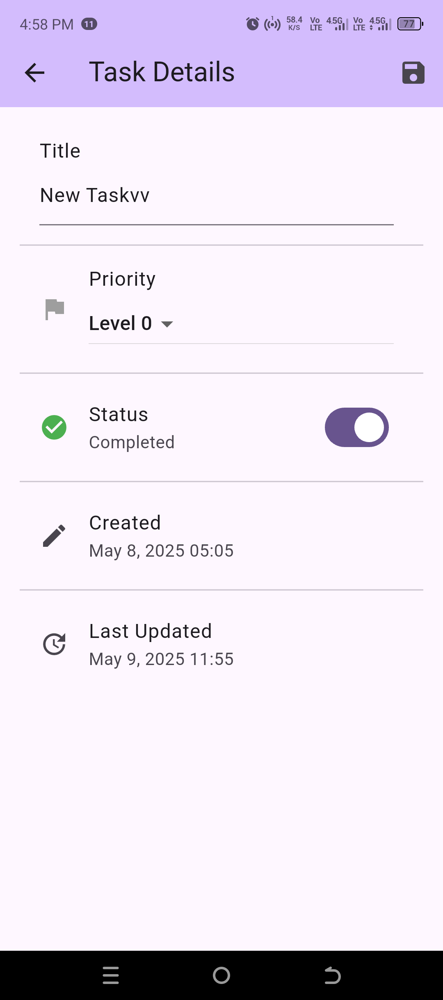
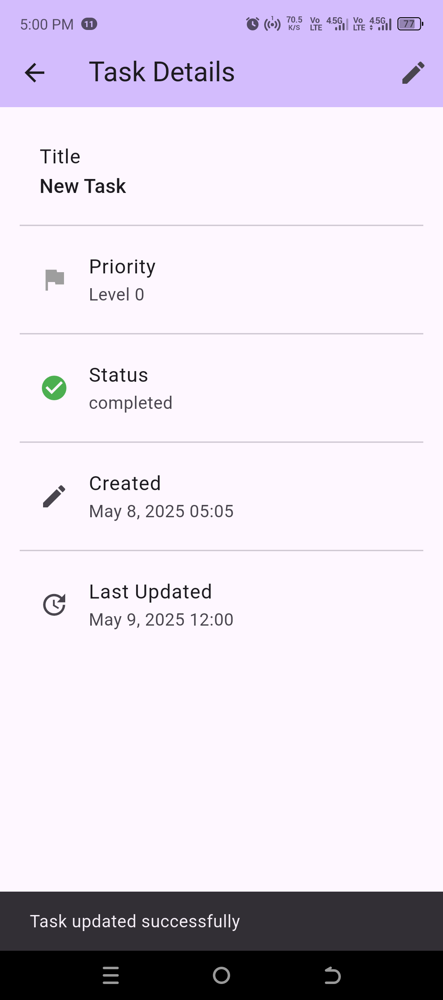

# mongo_db

See backend-api docs [here](./backend-api/README.md)

    
    
    
    
    
    
    

For help getting started with Flutter development, view the
[online documentation](https://docs.flutter.dev/), which offers tutorials,
samples, guidance on mobile development, and a full API reference.
