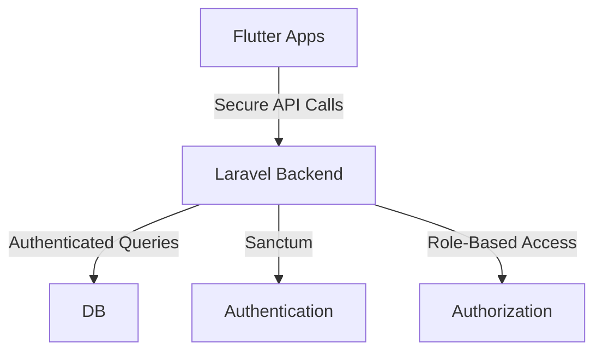

# Student Task Tracker App 📚

A real-time task management system for educational institutions with admin (teacher) and student interfaces.

## 🎯 Overview

A comprehensive platform where administrators can manage students and their tasks while students can track and complete their assignments in real-time.

## 🚀 Features

### 👨‍🏫 Admin Dashboard

| Feature            | Description                                                                         |
| ------------------ | ----------------------------------------------------------------------------------- |
| Student Management | • Upload via Excel<br>• Manual registration<br>• Edit/Delete accounts               |
| Task Management    | • Create and assign tasks<br>• Track completion status<br>• Set due dates           |
| Analytics          | • Task completion reports<br>• Top performers list<br>• Performance graphs          |
| Reports            | • Export student data<br>• Task completion statistics<br>• Custom report generation |

### 👨‍🎓 Student Portal

| Feature           | Description                                            |
| ----------------- | ------------------------------------------------------ |
| Authentication    | • Secure login with provided credentials               |
| Task Management   | • View assigned tasks<br>• Mark tasks as completed     |
| Progress Tracking | • Personal progress graph<br>• Task completion streaks |
| Dashboard         | • Task calendar<br>• Completion statistics             |

## 💾 Database Schema

### Users Collection

```json
{
  "_id": "ObjectId",
  "name": "Ali Raza",
  "email": "ali@student.com",
  "password": "hashed_password",
  "role": "student", // or "admin"
  "created_at": "2025-05-12T10:00:00Z"
}
```

### Tasks Collection

```json
{
  "_id": "ObjectId",
  "title": "Complete UI Design",
  "description": "Design task screen in Flutter",
  "assigned_to": "student_user_id",
  "status": "pending", // or "completed"
  "due_date": "2025-05-20",
  "created_by": "admin_user_id"
}
```

### Reports Collection (Optional)

```json
{
  "student_id": "ObjectId",
  "completed_tasks": 5,
  "pending_tasks": 3,
  "performance_score": 80
}
```

## 🛠 Tech Stack

| Component       | Technology         |
| --------------- | ------------------ |
| Frontend        | Flutter            |
| Backend         | Laravel 10.x       |
| Database        | PostgreSQL         |
| Authentication  | Sanctum/breeze     |
| File Processing | Laravel Excel      |
| Visualization   | fl_chart (Flutter) |

## 🎁 Bonus Features

- 🔔 Push Notifications for new task assignments
- 💬 In-app messaging between admin and students
- 🏆 Student leaderboard system
- 📈 Automated weekly/monthly reports
- 📧 Email notifications for student credentials

## 📱 Sample Dashboard Views

### Admin Dashboard

- Total Students Overview
- Daily Task Assignment Stats
- Top Performers Chart
- Task Completion Analytics

### Student Dashboard

- Personal Task List
- Progress Tracker
- Task Calendar View
- Performance Metrics

## 🔒 Security Architecture



## ⚙️ Getting Started

1. Clone the repository
2. Install dependencies
3. Configure environment variables
4. Run migrations
5. Start the development server

## 📋 Prerequisites

- PHP >= 8.1
- Composer
- Flutter SDK

## 🤝 Contributing

1. Fork the Project
2. Create your Feature Branch
3. Commit your Changes
4. Push to the Branch
5. Open a Pull Request
