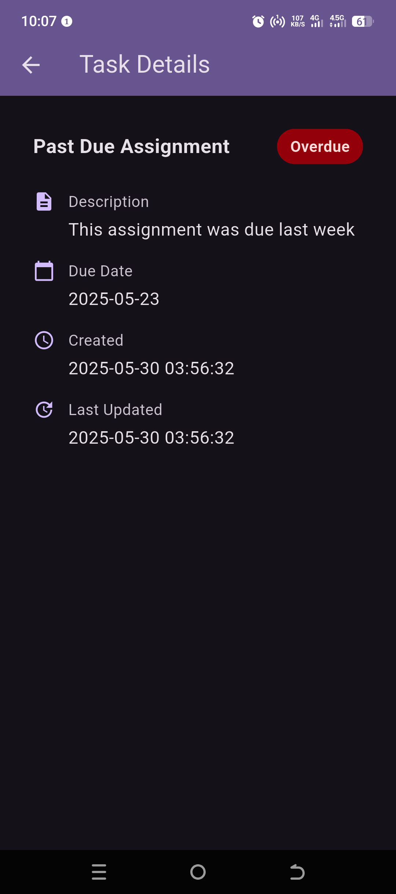
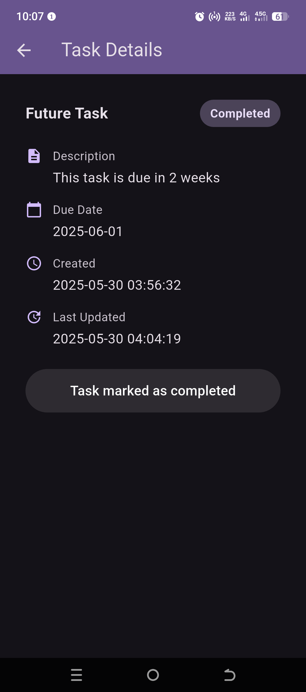

# Student Task Management System - Frontend

A Flutter-based mobile application that serves as the frontend for a student task management system. This application works in conjunction with a Laravel backend to provide a comprehensive task management solution for students.

## Screenshots

<div style="display: flex; flex-wrap: wrap; gap: 10px">
    
    
    
    
</div>

## Features

- **Authentication System**

  - Student login with registration number
  - Secure token-based authentication
  - Profile management
  - Secure logout functionality

- **Task Management**

  - View all assigned tasks
  - Filter tasks by different time periods:
    - All tasks
    - Today's tasks
    - Tasks due in 3 days
  - Task status tracking (Pending, Completed, Overdue)
  - Detailed task view with:
    - Title
    - Description
    - Due date
    - Creation date
    - Last updated time
  - Mark tasks as completed
  - Real-time task status updates

- **User Interface**
  - Material Design 3 implementation
  - Clean and intuitive interface
  - Responsive layout
  - Tab-based navigation
  - Pull-to-refresh functionality
  - Loading states and error handling
  - Status indicators for tasks
  - Profile screen with user information

## Technical Details

- **Framework**: Flutter
- **State Management**: Stateful Widgets
- **Backend Communication**: REST API using http package
- **Local Storage**: SharedPreferences for token and user data
- **Architecture**: Service-based architecture with:
  - API Service for backend communication
  - Auth Service for authentication management
  - Constants for configuration
  - Models for data structure
  - Screens for UI components
  - Widgets for reusable UI elements

## Project Structure

```
lib/
├── constants/
│   └── app_constants.dart      # Application-wide constants
├── models/
│   └── task.dart              # Task data model
├── screens/
│   ├── login_screen.dart      # Authentication UI
│   ├── profile_screen.dart    # User profile
│   └── task_details_screen.dart # Detailed task view
├── services/
│   ├── api_service.dart       # API communication
│   └── auth_service.dart      # Authentication handling
└── widgets/
    ├── task_card.dart         # Task list item
    ├── task_list.dart         # Task listing component
    └── task_list_tab_view.dart # Tab view for task filters
```

## Backend Communication

The app communicates with a Laravel backend through a RESTful API. The `ApiService` class handles all API communications with features like:

- Token-based authentication
- JSON request/response handling
- Error handling and status code management
- Automatic token inclusion in headers
